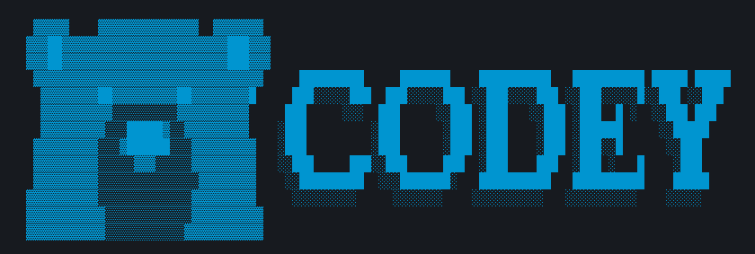

# Vibe Codey CLI



This is an issue-only repository for the Vibe Codey CLI (`codey`). We monitor this repo for feedback from the community.

If you have a feature or enhancement request, first review the [existing discussions](https://github.com/salesforcecli/codey/discussions) to see if someone has already requested it. If you don't see your feature or enhancement, click the **New discussion** button to create a new request.

Similarly, if you've encountered a bug with the Codey, check out the [existing issues](https://github.com/salesforcecli/codey/issues) to see if it's already been reported. If you don’t see your bug listed, click the **New issue** button to create one.

NOTICE: GitHub is not a mechanism for receiving support under any agreement or SLA. If you require immediate assistance, use official Salesforce customer support channels.

## 🚀 Why Vibe Codey CLI?

- **🧠 Powered by Salesforce LLM Gateway**: Access trusted and powerful generative Salesforce Fluent Reasoning models.
- **🔧 Built-in tools**: File operations, shell commands, web fetching, and more.
- **🔌 Extensible**: MCP (Model Context Protocol) support for custom integrations.
- **⚡ Includes Salesforce DX MCP Server**: Comes bundled with powerful tools for Salesforce development, including Aura-to-LWC migration, LWC component generation, code analysis, and mobile development utilities.
- **💻 Terminal-first**: Designed for developers who live in the command line.
- **🛡️ Open source**: Apache 2.0 licensed.


## 🔐 Authentication

Vibe Codey CLI uses your Salesforce Developer Edition org credentials to connect to the Salesforce LLM Gateway.

You can provide your org's username or alias in two ways:

### Option 1: Command-line flag (Recommended)

Pass the `--gateway-org` flag when you run `codey`:

```bash
codey --gateway-org your_username_or_alias
```

### Option 2: Environment variable

Set the `CODEY_GATEWAY_ORG` environment variable in your shell configuration file (e.g., `.zshrc`, `.bashrc`):

```bash
export CODEY_GATEWAY_ORG="your_username_or_alias"
```

Then you can run `codey` from any directory:

```bash
codey
```

## 🚀 Getting Started

### Basic Usage

#### Start in current directory

```bash
codey --gateway-org your_username_or_alias
```

#### Include multiple directories

```bash
codey --gateway-org your_username_or_alias --include-directories ../lib,../docs
```

#### Non-interactive mode for scripts

Get a simple text response:

```bash
codey -p "Explain the architecture of this codebase" --gateway-org your_username_or_alias
```

For more advanced scripting, including how to parse JSON and handle errors, use the `--output-format json` flag to get structured output:

```bash
codey -p "Explain the architecture of this codebase" --output-format json --gateway-org your_username_or_alias
```

### Quick Examples

#### Start a new project

```bash
cd new-project/
codey --gateway-org your_username_or_alias > Write me an LWC component that displays a list of accounts.
```

#### Analyze existing code

```bash
git clone https://github.com/salesforcecli/codey
cd codey
codey --gateway-org your_username_or_alias > Give me a summary of all of the changes that went in yesterday
```

## Included Tools: Salesforce DX MCP Server

Vibe Codey CLI comes bundled with the Salesforce DX MCP Server, providing a powerful suite of tools tailored for Salesforce development right out of the box. These tools can help you with a variety of tasks, from modernizing old codebases to building new components with best practices.

You can start using these tools by invoking them with `@mcp`. For example:

`> @mcp run_apex_test`

Here are some of the available toolsets:

- **Orgs**: Tools for performing org operations, including creating and deleting scratch orgs.
- **Metadata**: Tools for performing metadata operations, including deploying and retrieving metadata.
- **Data**: Tools for performing data operations, including querying and updating data.
- **Aura Experts**: Tools for migrating Aura components to Lightning Web Components (LWC), including creating and enhancing migration blueprints.
- **LWC Experts**: A comprehensive set of tools for LWC development. Create components, generate Jest tests, get guidance on best practices, accessibility, and security.
- **Code-Analyzer**: Perform static analysis on your code to check for best practices, security vulnerabilities, and performance issues.
- **Mobile Toolsets**: Utilities for building mobile Lightning Web Components, with support for features like barcode scanning, biometrics, and NFC.

To see all available tools, you can run:

`> /mcp list`

## 📚 Documentation

### Getting Started

- [**Quickstart Guide**](./docs/cli/index.md) - Get up and running quickly
- [**Configuration Guide**](./docs/cli/configuration.md) - Settings and customization
- [**Keyboard Shortcuts**](./docs/keyboard-shortcuts.md) - Productivity tips

### Core Features

- [**Commands Reference**](./docs/cli/commands.md) - All slash commands (`/help`, `/chat`, `/mcp`, etc.)
- [**Checkpointing**](./docs/checkpointing.md) - Save and resume conversations
- [**Memory Management**](./docs/tools/memory.md) - Using CODEY.md context files

### Tools & Extensions

- [**Built-in Tools Overview**](./docs/tools/index.md)
  - [File System Operations](./docs/tools/file-system.md)
  - [Shell Commands](./docs/tools/shell.md)
  - [Web Fetch & Search](./docs/tools/web-fetch.md)
  - [Multi-file Operations](./docs/tools/multi-file.md)
- [**MCP Server Integration**](./docs/tools/mcp-server.md) - Extend with custom tools

### Advanced Topics

- [**Architecture Overview**](./docs/architecture.md) - How Vibe Codey CLI works
- [**Enterprise Deployment**](./docs/deployment.md) - Docker, system-wide config
- [**Telemetry & Monitoring**](./docs/telemetry.md) - Usage tracking
- [**Tools API Development**](./docs/core/tools-api.md) - Create custom tools

### Configuration & Customization

- [**Settings Reference**](./docs/cli/configuration.md) - All configuration options
- [**Theme Customization**](./docs/cli/themes.md) - Visual customization
- [**.codey Directory**](./docs/codey-ignore.md) - Project-specific settings
- [**Environment Variables**](./docs/cli/configuration.md#environment-variables)

### Troubleshooting & Support

- [**Troubleshooting Guide**](./docs/troubleshooting.md) - Common issues and solutions
- Use `/bug` command to report issues directly from the CLI

### Using MCP Servers

Configure MCP servers in `~/.codey/settings.json` to extend Codey CLI with custom tools:

```text
> @github List my open pull requests
> @slack Send a summary of today's commits to #dev channel
> @database Run a query to find inactive users
```

See the [MCP Server Integration guide](./docs/tools/mcp-server.md) for setup instructions.

## 🤝 Contributing

We welcome contributions! Vibe Codey CLI is fully open source (Apache 2.0), and we encourage the community to:

- Report bugs and suggest features
- Improve documentation
- Submit code improvements
- Share your MCP servers and extensions

See our [Contributing Guide](./CONTRIBUTING.md) for development setup, coding standards, and how to submit pull requests.

### Run Locally

```
git clone https://github.com/salesforcecli/codey.git
cd codey
npm install
npm run build
```

Set the `CODEY_GATEWAY_ORG` in your environment:

```
export CODEY_GATEWAY_ORG="your_username_here"
```

Finally, run Codey from the project root:

```
node ./scripts/start.js
```

## 📖 Resources

- [**NPM Package**](https://www.npmjs.com/package/@salesforce/code) - Package registry
- [**GitHub Issues**](https://github.com/salesforcecli/codey/issues) - Report bugs or request features
- [**Security Advisories**](https://github.com/salesforcecli/codey/security/advisories) - Security updates

### Uninstall

See the [Uninstall Guide](docs/Uninstall.md) for removal instructions.

## 📄 Legal

- **License**: [Apache License 2.0](LICENSE.txt)
- **Security**: [Security Policy](SECURITY.md)

---

Built with ❤️ by Salesforce and the open source community
