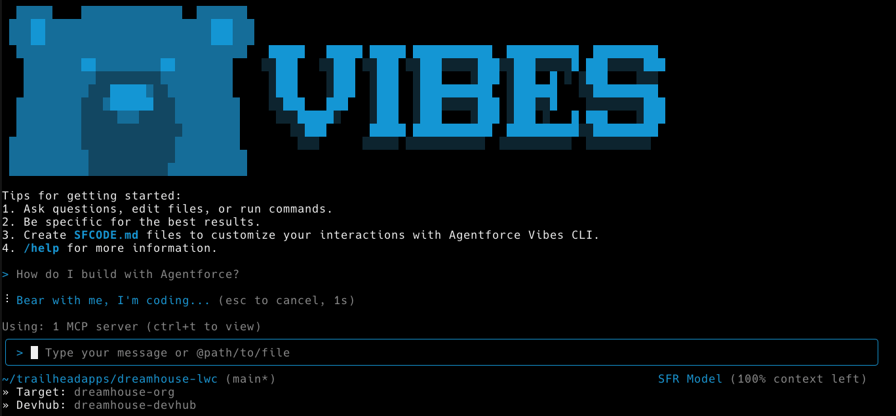

# Codey

[](https://github.com/mdonnalley/gemini-cli/actions/workflows/ci.yml)
[](https://www.npmjs.com/package/@google/gemini-cli)
[](https://github.com/google-gemini/gemini-cli/blob/main/LICENSE)



Codey is an open-source AI agent that brings the power and trust of Salesforce's LLM Gateway directly into your terminal.

## 🚀 Why Codey?

- **🧠 Trusted Salesforce LLM Gateway**: Ensure your prompts are executed in a trusted environment.
- **🔧 Built-in tools**: Google Search grounding, file operations, shell commands, web fetching
- **🔌 Extensible**: MCP (Model Context Protocol) support for custom integrations
- **💻 Terminal-first**: Designed for developers who live in the command line
- **🛡️ Open source**: Apache 2.0 licensed

## 📦 Installation

### Quick Install

#### Run instantly with npx

```bash
# Using npx (no installation required)
npx https://github.com/salesforcecli/codey
```

#### Install globally with npm

```bash
npm install -g @salesforce/codey
```

#### Install globally with Homebrew (macOS/Linux)

```bash
brew install codey
```

#### System Requirements

- Node.js version 20 or higher
- macOS, Linux, or Windows

## Release Cadence and Tags

See [Releases](./docs/releases.md) for more details.

### Preview

New preview releases will be published each week at UTC 2359 on Tuesdays. These releases will not have been fully vetted and may contain regressions or other outstanding issues. Please help us test and install with `preview` tag.

```bash
npm install -g @salesforce/codey@preview
```

### Stable

- New stable releases will be published each week at UTC 2000 on Tuesdays, this will be the full promotion of last week's `preview` release + any bug fixes and validations. Use `latest` tag.

```bash
npm install -g @salesforce/codey@latest
```

### Nightly

- New releases will be published each week at UTC 0000 each day, This will be all changes from the main branch as represented at time of release. It should be assumed there are pending validations and issues. Use `nightly` tag.

```bash
npm install -g @salesforce/codey@nightly
```

## 📋 Key Features

### Code Understanding & Generation

- Query and edit large codebases
- Generate new apps from PDFs, images, or sketches using multimodal capabilities
- Debug issues and troubleshoot with natural language

### Automation & Integration

- Automate operational tasks like querying pull requests or handling complex rebases
- Use MCP servers to connect new capabilities, including [media generation with Imagen, Veo or Lyria](https://github.com/GoogleCloudPlatform/vertex-ai-creative-studio/tree/main/experiments/mcp-genmedia)
- Run non-interactively in scripts for workflow automation

### Advanced Capabilities

- Ground your queries with built-in [Google Search](https://ai.google.dev/gemini-api/docs/grounding) for real-time information
- Conversation checkpointing to save and resume complex sessions
- Custom context files (GEMINI.md) to tailor behavior for your projects

### GitHub Integration

Integrate Gemini CLI directly into your GitHub workflows with [**Gemini CLI GitHub Action**](https://github.com/google-github-actions/run-gemini-cli):

- **Pull Request Reviews**: Automated code review with contextual feedback and suggestions
- **Issue Triage**: Automated labeling and prioritization of GitHub issues based on content analysis
- **On-demand Assistance**: Mention `@gemini-cli` in issues and pull requests for help with debugging, explanations, or task delegation
- **Custom Workflows**: Build automated, scheduled and on-demand workflows tailored to your team's needs

## 🚀 Getting Started

### Basic Usage

#### Start in current directory

```bash
gemini
```

#### Include multiple directories

```bash
gemini --include-directories ../lib,../docs
```

#### Use specific model

```bash
gemini -m gemini-2.5-flash
```

#### Non-interactive mode for scripts

```bash
gemini -p "Explain the architecture of this codebase"
```

### Quick Examples

#### Start a new project

```bash
cd new-project/
gemini
> Write me a Discord bot that answers questions using a FAQ.md file I will provide
```

#### Analyze existing code

```bash
git clone https://github.com/google-gemini/gemini-cli
cd gemini-cli
gemini
> Give me a summary of all of the changes that went in yesterday
```

## 📚 Documentation

### Getting Started

- [**Quickstart Guide**](./docs/cli/index.md) - Get up and running quickly
- [**Authentication Setup**](./docs/cli/authentication.md) - Detailed auth configuration
- [**Configuration Guide**](./docs/cli/configuration.md) - Settings and customization
- [**Keyboard Shortcuts**](./docs/keyboard-shortcuts.md) - Productivity tips

### Core Features

- [**Commands Reference**](./docs/cli/commands.md) - All slash commands (`/help`, `/chat`, `/mcp`, etc.)
- [**Checkpointing**](./docs/checkpointing.md) - Save and resume conversations
- [**Memory Management**](./docs/tools/memory.md) - Using GEMINI.md context files
- [**Token Caching**](./docs/cli/token-caching.md) - Optimize token usage

### Tools & Extensions

- [**Built-in Tools Overview**](./docs/tools/index.md)
  - [File System Operations](./docs/tools/file-system.md)
  - [Shell Commands](./docs/tools/shell.md)
  - [Web Fetch & Search](./docs/tools/web-fetch.md)
  - [Multi-file Operations](./docs/tools/multi-file.md)
- [**MCP Server Integration**](./docs/tools/mcp-server.md) - Extend with custom tools
- [**Custom Extensions**](./docs/extension.md) - Build your own commands

### Advanced Topics

- [**Architecture Overview**](./docs/architecture.md) - How Gemini CLI works
- [**IDE Integration**](./docs/ide-integration.md) - VS Code companion
- [**Sandboxing & Security**](./docs/sandbox.md) - Safe execution environments
- [**Enterprise Deployment**](./docs/deployment.md) - Docker, system-wide config
- [**Telemetry & Monitoring**](./docs/telemetry.md) - Usage tracking
- [**Tools API Development**](./docs/core/tools-api.md) - Create custom tools

### Configuration & Customization

- [**Settings Reference**](./docs/cli/configuration.md) - All configuration options
- [**Theme Customization**](./docs/cli/themes.md) - Visual customization
- [**.codey Directory**](./docs/gemini-ignore.md) - Project-specific settings
- [**Environment Variables**](./docs/cli/configuration.md#environment-variables)

### Troubleshooting & Support

- [**Troubleshooting Guide**](./docs/troubleshooting.md) - Common issues and solutions
- [**FAQ**](./docs/troubleshooting.md#frequently-asked-questions) - Quick answers
- Use `/bug` command to report issues directly from the CLI

### Using MCP Servers

Configure MCP servers in `~/.codey/settings.json` to extend Codey with custom tools:

```text
> @github List my open pull requests
> @slack Send a summary of today's commits to #dev channel
> @database Run a query to find inactive users
```

See the [MCP Server Integration guide](./docs/tools/mcp-server.md) for setup instructions.

## 🤝 Contributing

We welcome contributions! Codey is fully open source (Apache 2.0), and we encourage the community to:

- Report bugs and suggest features
- Improve documentation
- Submit code improvements
- Share your MCP servers and extensions

See our [Contributing Guide](./CONTRIBUTING.md) for development setup, coding standards, and how to submit pull requests.

Check our [Official Roadmap](https://github.com/orgs/google-gemini/projects/11/) for planned features and priorities.

## 📖 Resources

- **[Official Roadmap](./ROADMAP.md)** - See what's coming next
- **[NPM Package](https://www.npmjs.com/package/@google/gemini-cli)** - Package registry
- **[GitHub Issues](https://github.com/google-gemini/gemini-cli/issues)** - Report bugs or request features
- **[Security Advisories](https://github.com/google-gemini/gemini-cli/security/advisories)** - Security updates

### Uninstall

See the [Uninstall Guide](docs/Uninstall.md) for removal instructions.

## 📄 Legal

- **License**: [Apache License 2.0](LICENSE)
- **Terms of Service**: [Terms & Privacy](./docs/tos-privacy.md)
- **Security**: [Security Policy](SECURITY.md)

---

<p align="center">
  Built with ❤️ by Google and the open source community
</p>
